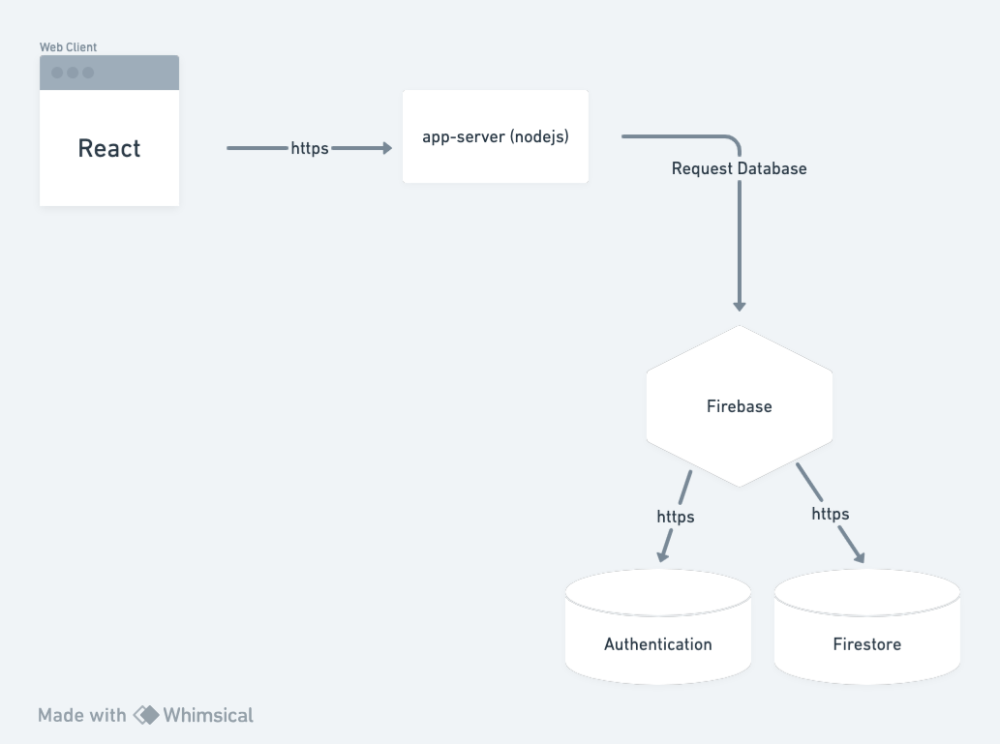
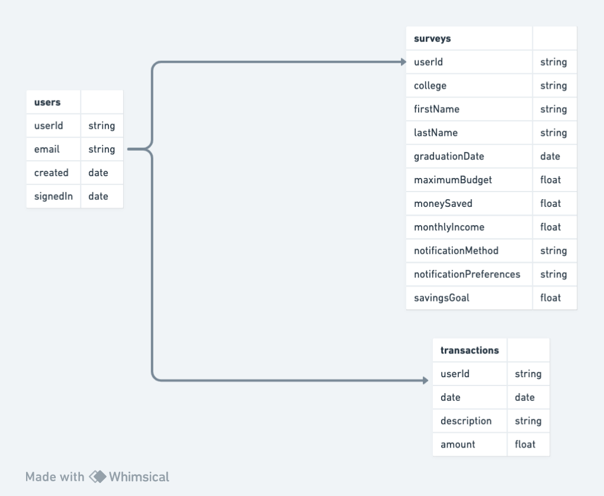
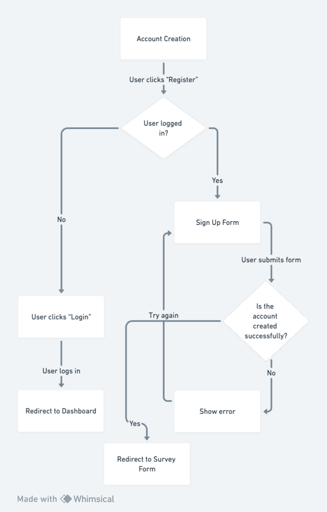

# Wise Wallet Architecture

## High Level Component
The client (written in React) is sending a request to the the backend to send a request to Firebase, which contains both the authentication service as well as Firetore, which stores other collections of data such as user surveys and transactions.

## Entity Diagram
The three collections are users, surveys, and transactions. Due to the nature of Firebase (NOSQL),the users authentication info is stored separately under the 'Authentication' tab in Firebase. In Firestore, there is a surveys and transactions collections, which both utilize use the userID from authentication to assign a certain survey or transaction to a specific user.

## Flow Diagram
The account creation process is shown in this diagram. When a user clicks on Register, they are taken to a Sign Up form. Once they enter the details and if the registration is successful, they are redirected to a survey form, which collects additional information from such as their budget or income. This information is separate from the process of authentication. If they are not successful in signing up, they will be redirected to fill out the sign up details again. If they are already an existing user, they can click on Login in the navbar and will be redirected to the dashboard.

