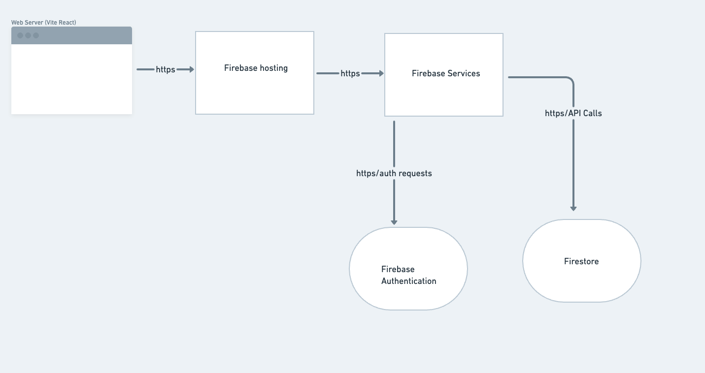
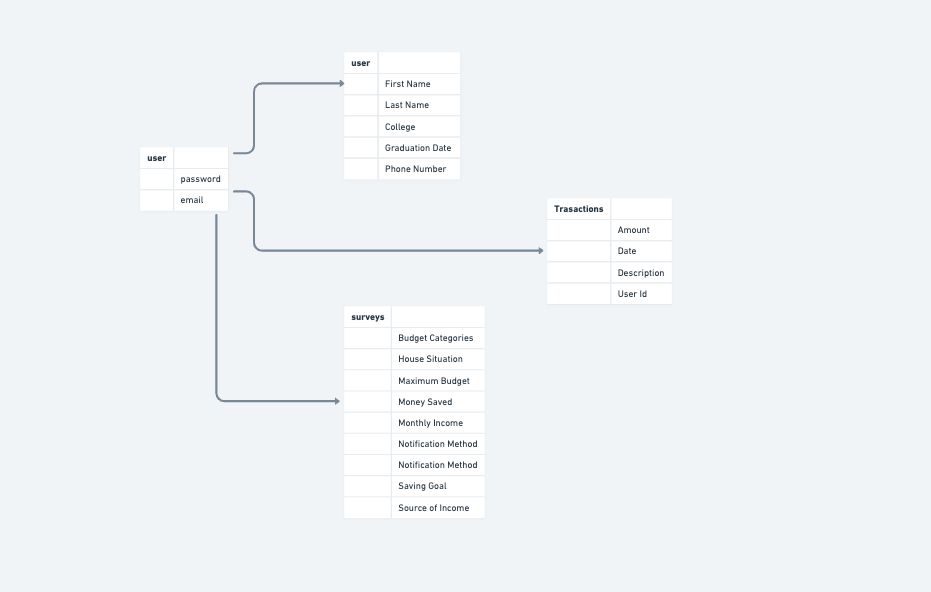
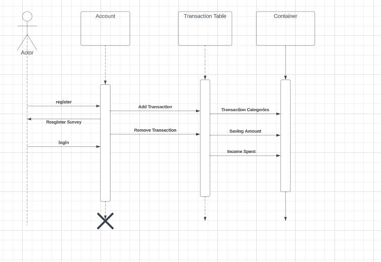

In this diagram I show that our web server is a Vite React application, which means our entire frontend is Vite React. Our backend is created by Firebase, which is shown by Firebase hosting. We used Firebase to process all of our backend requests. Through Firebase, we use a couple services provided by it. The first service is Firebase authentication, which handles all of our registration requests, as well as our login requests. In other words, it autheticates users, whether they have an account, or not. Next we use the Firestore to handle all of our database collections. With Firestore, we hold our user information and transaction requests.

This diagrams shows how our databse works. First the user needs to make an account through Firebase authentication. Once an account is made, users will be given a survey they can fill, with all their neccessary information for the expense trackers. This is also where the users collection comes in, which records personal information, which can be later updated. Lastly another table, Transactions records all the user's transaction and when theyre made.

This records the flow of a user, when they're on our application. When a user enters our site, they first need to sign up, which prompts them to fill out a registration survey. Once the fills out, they can login to the site. In the site they can enter transactions or delete already made transactions. Once they record their transcations, the data is visible for users to check o the dashboard. It also allows them to see how far off they are in their montly budget.
