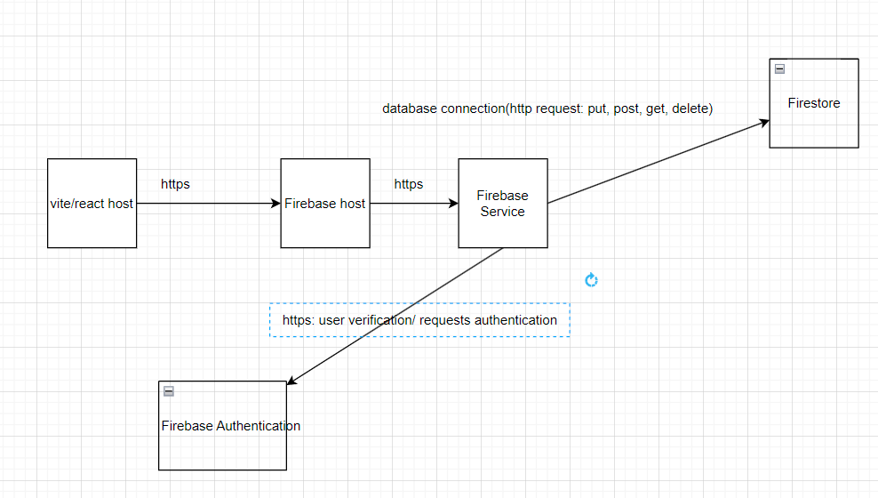
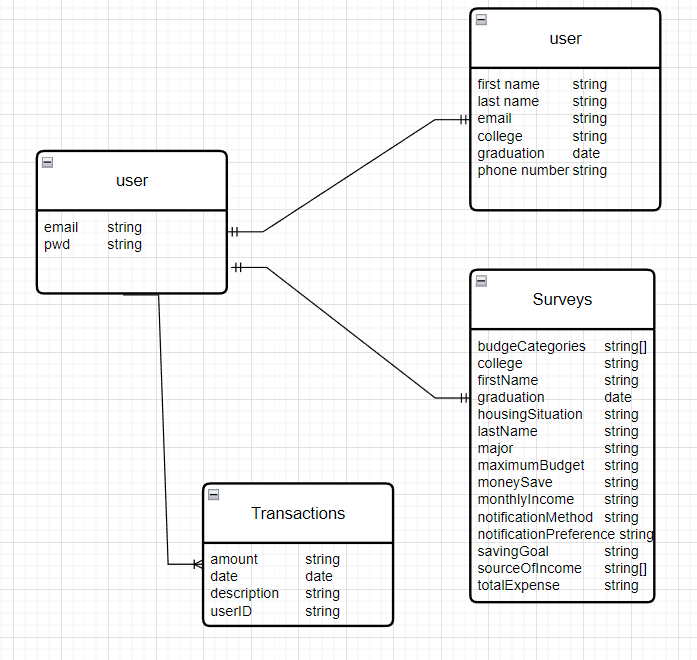
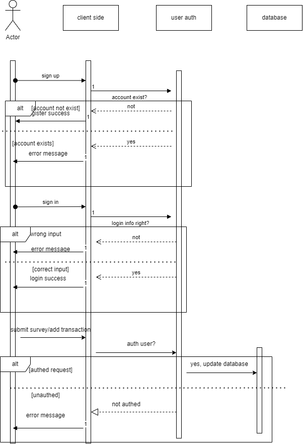

1. we can interact with the web that is hosted by the vite server at local host 5173. When there is operations involves API calls, we interact with the firebase server via the firebase host. Request needs user verifaction or user authentication will be towards the firebase authentication, otherwise is towards the firestore 
2. In this diagram, the user collection in firebase authentication has 1-to-1 relation to user collection in firestore database,\; has 1-to-1 to survey; has 1-to-many to the transactions
3. When a user try to sign up through the frontend, the client side will check with the auth that if the account exitst. if exists, return error message, else register success; When user login, the client side checks if the account info matches with the auth, if matchsm the user is verified and therefore logged in, else return error message. For submitting survey and add transaction, client will first check the auth that if this request is authorized, if not reuturn error message, else update the database. 
